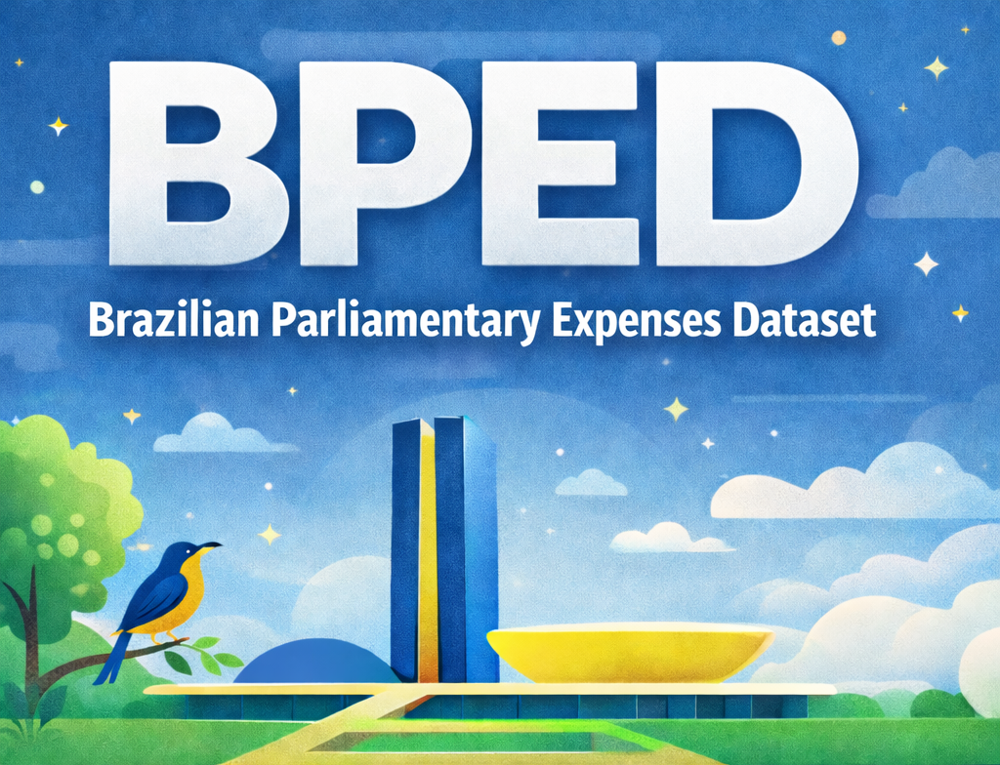

# 🇧🇷 Brazilian Parliamentary Expenses Dataset (BPED)

This repository provides the **Brazilian Parliamentary Expenses Dataset (BPED)** and the full **data processing and modeling pipeline** used to construct and analyze it.

BPED contains reimbursed expenses from the Brazilian Chamber of Deputies under the *Cota para o Exercício da Atividade Parlamentar (CEAP)* program, covering **2019–2023**, and is designed for **public spending analysis, transparency research, and anomaly/fraud detection**.

---

## 📊 Dataset Overview

Each record represents a single reimbursement transaction and includes both **raw transactional attributes** and a **derived contextual feature** capturing supplier-level spending behavior.

### Included Expense Categories

* Food services
* Fuel and lubricants
* Vehicle rental or chartering
* Telecommunication services

Only **non-negative, validated reimbursements** are included.

---

## 🧾 Dataset Columns

| Column                    | Description                                                                                |
| ------------------------- | ------------------------------------------------------------------------------------------ |
| `txtFornecedor`           | Supplier or service provider name as reported on the invoice                               |
| `field_value_ajustmented` | Adjusted reimbursement amount paid to the supplier (BRL)                                   |
| `sgPartido`               | Political party acronym of the parliamentarian responsible for the expense                 |
| `datEmissao`              | Invoice issuance date                                                                      |
| `mean_value`              | Average adjusted reimbursement value historically associated with the same supplier (BRL) |

> `mean_value` is a **derived feature** computed as the mean reimbursement value across all transactions involving the same supplier, providing a peer-based reference for anomaly detection.

---

## 📖 Citation and Reference

If you use this dataset, the associated code, or derived results in **academic work, reports, or publications**, please **cite the following reference**:

> Schiavon, J. P. *et al.*  
> **Anomaly Detection in Brazilian Parliamentary Expenses Using Ensemble Unsupervised Models**.  
> *Research Square*, 2025.  
> DOI: https://doi.org/10.21203/rs.3.rs-7817731/v1

The dataset and methodology presented in this repository are directly derived from and described in the above work.

---

## 📜 License and Data Source

The data originate from **official public records** released by the Brazilian Chamber of Deputies.  
This repository is intended for **research, transparency, and educational purposes**.
